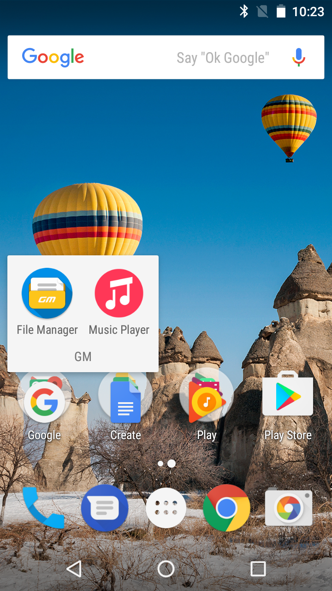

### What is `classes.dex`

Quote from [Role of classes.dex file in an apk file](https://stackoverflow.com/questions/14230573/role-of-classes-dex-file-in-an-apk-file):

> To make an APK file, a program for Android is first compiled, and then all of its parts are packaged into one file. This holds all of that program's code (These are the .dex files), resources, assets, certificates, and manifest file.

> Programs are commonly written in Java and compiled to bytecode. They are then converted from Java Virtual Machine-compatible .class files to Dalvik-compatible .dex (Dalvik Executable) files before installation on a device. The compact Dalvik Executable format is designed to be suitable for systems that are constrained in terms of memory and processor speed.

> - `classes.dex`: The classes compiled in the dex file format understandable by the Dalvik virtual machine

### What is an ODEX file

Quote from [What are ODEX files in Android?](https://stackoverflow.com/questions/9593527/what-are-odex-files-in-android):

> Applications are basically glorified ZIP archives. The java code is stored in a file called classes.dex and this file is parsed by the Dalvik JVM and a cache of the processed `classes.dex` file is stored in the phone's Dalvik cache.

> An odex is basically a pre-processed version of an application's `classes.dex` that is execution-ready for Dalvik. **When an application is odexed, the `classes.dex` is removed from the APK archive** and it does not write anything to the Dalvik cache. An application that is not odexed ends up with 2 copies of the `classes.dex` file - the packaged one in the APK, and the processed one in the Dalvik cache. It also takes a little longer to launch the first time since Dalvik has to extract and process the `classes.dex` file.

### What happened when compiling `PlayAutoInstallConfig-xxx.apk` for **GM5** in **GM5 Plus** build tree

The default build configuration for **GM5 Plus is set as odexed** but **not for GM5**. When compiling the `PlayAutoInstallConfig-xxx.apk` in **GM5 Plus** build tree, the `classes.dex` is removed from the APK file and it will generate the ODEX file instead additionally.

Build output for GM5 (`classed.dex` included in the APK):


Build output for GM5 Plus (default odexed, no `classes.dex` in the APK):


As result `PlayAutoInstallConfig-xxx.apk` lost some neccesary content and important information, like layout configuration. And when we upload the single APK file on APFE - Android Partner Frontend, the phone can successfully get the APKs in the rule that we defined in `PlayAutoInstallConfig-xxx.apk`, but cannot fetch the right layout configuration.

### How to solve the problem

To build a single complete `PlayAutoInstallConfig-xxx.apk` without ODEX files generated, just disable the pre-processed configuration in `build_apk.mk`:

```mk
LOCAL_DEX_PREOPT := false
```

And that is what we did to configure PAI for GM5 Plus.

Although this approach can solve the problem, we suggest to **build the APK files in their corresponding build trees**, since different projects have different build configurations.

### Test result

GM5 successfully downloaded and installed the APKs, and the layout is correct:



